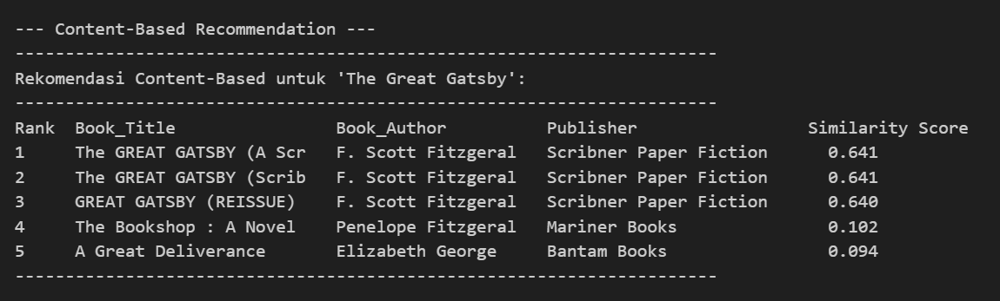
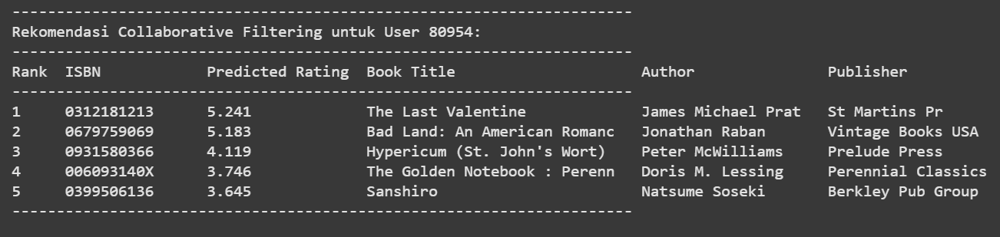

# Laporan Proyek Machine Learning - Sistem Rekomendasi Buku

## Project Overview

Sistem rekomendasi buku menjadi solusi penting dalam membantu pengguna menemukan buku yang relevan di tengah banyaknya pilihan yang tersedia. Dengan semakin berkembangnya dunia digital dan meningkatnya jumlah buku yang diterbitkan setiap tahun, pengguna seringkali mengalami kesulitan dalam memilih buku yang sesuai dengan preferensi mereka. Sistem rekomendasi dapat meningkatkan pengalaman pengguna, mempercepat proses pencarian, dan meningkatkan penjualan atau keterlibatan pada platform buku.

Beberapa penelitian telah menunjukkan efektivitas sistem rekomendasi dalam meningkatkan kepuasan pengguna dan retensi pada platform digital [1][2]. Sistem rekomendasi yang baik dapat memanfaatkan data historis pengguna, konten buku, serta interaksi antar pengguna untuk memberikan saran yang lebih personal.

## Business Understanding

### Problem Statements

- Bagaimana membangun sistem rekomendasi buku yang dapat memberikan saran buku relevan kepada pengguna berdasarkan data historis dan konten buku?
- Bagaimana membandingkan efektivitas pendekatan content-based filtering dan collaborative filtering dalam sistem rekomendasi buku?

### Goals

- Menghasilkan sistem rekomendasi buku yang mampu memberikan rekomendasi top-N buku untuk setiap pengguna.
- Mengevaluasi dan membandingkan performa dua pendekatan utama: content-based filtering dan collaborative filtering.

### Solution Approach

#### Solution statements

- **Pendekatan Content-Based Filtering:** Menggunakan fitur konten buku (judul, penulis, penerbit) dan menghitung kemiripan antar buku menggunakan TF-IDF dan cosine similarity.
- **Pendekatan Collaborative Filtering (SVD):** Menggunakan interaksi pengguna-buku (rating) dan menerapkan matrix factorization (SVD) untuk memprediksi rating buku yang belum pernah dibaca pengguna.

## Data Understanding

Dataset yang digunakan terdiri dari tiga file utama:
- **Books.csv:** Informasi buku (ISBN, judul, penulis, tahun terbit, penerbit, URL gambar).
- **Users.csv:** Informasi pengguna (User-ID, lokasi, usia).
- **Ratings.csv:** Data interaksi pengguna-buku berupa rating (User-ID, ISBN, Book-Rating).

Dataset ini dapat diunduh dari [book-recommendation-dataset](https://www.kaggle.com/datasets/arashnic/book-recommendation-dataset).

**Deskripsi variabel:**

**Books.csv**
- `ISBN`: Kode unik buku.
- `Book_Title`: Judul buku.
- `Book_Author`: Nama penulis.
- `Year_Of_Publication`: Tahun terbit buku.
- `Publisher`: Nama penerbit.
- `Image_URL_S`: URL gambar sampul buku ukuran kecil.
- `Image_URL_M`: URL gambar sampul buku ukuran sedang.
- `Image_URL_L`: URL gambar sampul buku ukuran besar.

**Users.csv**
- `User_ID`: ID unik pengguna.
- `Location`: Lokasi pengguna.
- `Age`: Usia pengguna.

**Ratings.csv**
- `User_ID`: ID unik pengguna.
- `ISBN`: Kode unik buku.
- `Book_Rating`: Rating yang diberikan pengguna (0–10).

**Insight Data:**
- Terdapat 271.360 entri buku, 278.858 pengguna, dan 1.149.780 interaksi rating.
- Terdapat missing value pada beberapa kolom (Book_Author, Publisher, Age).
- Ditemukan outlier pada kolom usia (0 dan 244 tahun).
- Distribusi rating didominasi oleh nilai tertentu, dan data bersifat sparse.

**Deskripsi variabel:**
- `ISBN`: Kode unik buku.
- `Book_Title`: Judul buku.
- `Book_Author`: Nama penulis.
- `Year_Of_Publication`: Tahun terbit.
- `Publisher`: Nama penerbit.
- `User_ID`: ID unik pengguna.
- `Location`: Lokasi pengguna.
- `Age`: Usia pengguna.
- `Book_Rating`: Rating yang diberikan pengguna (0–10).

**Insight Data:**
- Terdapat 271.360 entri buku, 278.858 pengguna, dan 1.149.780 interaksi rating.
- Terdapat missing value pada beberapa kolom (Book_Author, Publisher, Age).
- Ditemukan outlier pada kolom usia (0 dan 244 tahun).
- Distribusi rating didominasi oleh nilai tertentu, dan data bersifat sparse.

## Data Preparation

- **Rename kolom** agar konsisten.
- **Hapus kolom gambar** pada books.
- **Bersihkan missing value** pada kolom penting (Book_Author, Publisher, Book_Title).
- **Konversi Year_Of_Publication** ke integer dan filter tahun yang valid (1900–tahun sekarang).
- **Tangani missing value dan outlier usia** pada users (isi dengan median, filter usia <5 atau >100).
- **Sinkronisasi data**: hanya gunakan rating yang ISBN dan User_ID-nya ada di books dan users.
- **Ambil rating eksplisit** (Book_Rating ≠ 0).
- **Filter pengguna aktif** (minimal 5 rating) dan buku populer (minimal 10 rating).
- **Gabungkan data** menjadi satu dataframe untuk analisis dan modeling.
- **Ekstraksi Fitur Teks dengan TF-IDF:**  
  Pada tahap persiapan data, fitur teks (judul, penulis, penerbit) digabungkan dan diubah menjadi representasi numerik menggunakan teknik **TF-IDF (Term Frequency-Inverse Document Frequency)**. Hasil transformasi ini akan digunakan untuk menghitung kemiripan antar buku pada tahap modeling.

_Alasan:_  
Tahapan ini penting untuk memastikan data yang digunakan bersih, konsisten, dan relevan untuk membangun model rekomendasi yang akurat.

## Modeling

### Content-Based Filtering

- Menggabungkan fitur konten buku (judul, penulis, penerbit).
- Menggunakan cosine similarity untuk menghitung kemiripan antar buku.
- Rekomendasi diberikan berdasarkan buku yang mirip dengan buku yang pernah disukai pengguna.

### Collaborative Filtering (SVD)

- Menggunakan library `surprise` untuk matrix factorization.
- Model SVD dilatih pada data rating eksplisit.
- Prediksi rating buku yang belum pernah dibaca pengguna, lalu rekomendasikan top-N dengan prediksi tertinggi.

**Kelebihan & Kekurangan:**
- Content-Based: Tidak mengalami cold start untuk item baru, namun kurang personalisasi.
- Collaborative Filtering: Lebih personal, namun butuh data interaksi yang cukup dan rawan cold start untuk user/item baru.

## Evaluation

### Content-Based Filtering

- **Metrik:** Precision@5 dan Recall@5.
- **Hasil:**  
  - Average Precision@5: 0.0367  
  - Average Recall@5: 0.1344

**Formula:**
- Precision@K = (Jumlah rekomendasi relevan di top-K) / K
- Recall@K = (Jumlah rekomendasi relevan di top-K) / (Jumlah item relevan)

### Collaborative Filtering (SVD)

- **Metrik:** Root Mean Squared Error (RMSE) dan Mean Absolute Error (MAE).
- **Hasil:**  
  - RMSE: 3.5830  
  - MAE: 2.9496

**Formula:**
- RMSE = sqrt(mean((rating_prediksi - rating_asli)^2))
- MAE = mean(|rating_prediksi - rating_asli|)

**Interpretasi:**  
Content-based filtering memiliki recall yang cukup baik namun precision rendah, sedangkan collaborative filtering menghasilkan prediksi rating dengan error yang masih cukup besar namun lebih adaptif terhadap preferensi pengguna.

---

_Catatan:_
- Visualisasi distribusi usia, tahun terbit, dan rating telah dilakukan untuk memahami data lebih lanjut.
- Kode dan tabel hasil evaluasi dapat dilihat pada notebook.

**---Ini adalah bagian akhir laporan---**